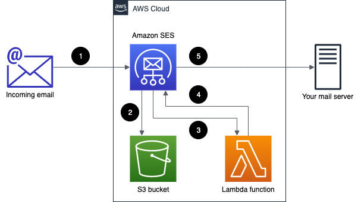

# AWS Email Forwarder

This project is an implementation of a simple AWS email forwarder following [these steps](https://aws.amazon.com/blogs/messaging-and-targeting/forward-incoming-email-to-an-external-destination/):

1. A new email is sent from an external sender to your domain. Amazon SES handles the incoming email for your domain.

2. An Amazon SES receipt rule saves the incoming message in an S3 bucket.

3. An Amazon SES receipt rule triggers the execution of a Lambda function.

4. The Lambda function retrieves the message content from S3, and then creates a new message and sends it to Amazon SES.

5. Amazon SES sends the message to the destination server.

We are using [serverless-stack](https://github.com/serverless-stack/serverless-stack) to manage infrastructure as code ( CDK under the hoods ) and Lambda development and deployment.

## Getting Started

The project has two main configuration environment varibles:

- BUCKET_NAME: which is the name of the S3 bucket of step 2 we are going to create
- RECIPIENTS: is a comma separated lists of recipients we are going to handle with this email forwarder

### `npm run start`

Starts the local Lambda development environment.

### `npm run build`

Build your app and synthesize your stacks.

Generates a `.build/` directory with the compiled files and a `.build/cdk.out/` directory with the synthesized CloudFormation stacks.

### `npm run deploy [stack]`

Deploy all your stacks to AWS. Or optionally deploy a specific stack.

### `npm run remove [stack]`

Remove all your stacks and all of their resources from AWS. Or optionally remove a specific stack.

### `npm run test`

Runs your tests using Jest. Takes all the [Jest CLI options](https://jestjs.io/docs/en/cli).